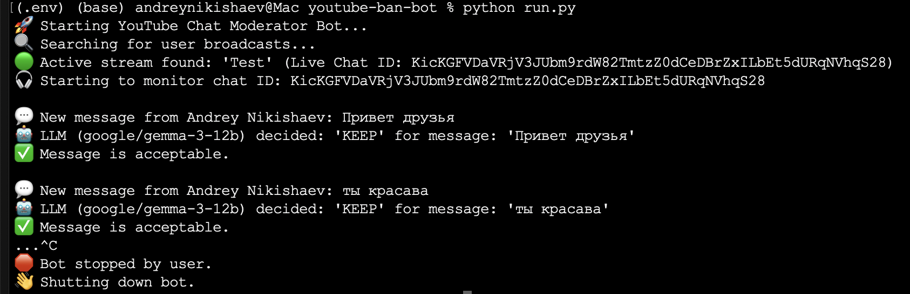

# YouTube Moderator Bot
This Python script provides an automated solution for moderating live YouTube chat comments using a local Large Language Model (LLM) via LM Studio. The bot can detect and delete comments that are deemed inappropriate based on a configurable system prompt.



## Features
* Real-time Moderation: Monitors live chat messages from your YouTube streams.
* LLM-Powered Analysis: Sends chat messages to a local LLM (running via LM Studio) for content analysis.
* Configurable Rules: The LLM's behavior is guided by a system prompt, allowing you to define what constitutes an "inappropriate" comment (e.g., insults, spam, profanity, political statements, advertisements).
* Automated Deletion: Automatically deletes comments identified as inappropriate by the LLM.
* Easy Setup: Straightforward setup with Google API authentication and LM Studio integration.

## Prerequisites
Before you can run this bot, ensure you have the following:

* Python 3.13+: Installed on your computer.
* LM Studio:
    * Download and install LM Studio from its [official website](https://lmstudio.ai).
    * Download an LLM: In LM Studio, download a suitable LLM model (e.g., a small and fast model optimized for text classification or chat).
    * Start Local Server: Launch the local server in LM Studio (usually at http://localhost:1234). Make a note of the model name you've loaded and are using on the server; you'll need it for configuration.
* Google Cloud Project:
    * Create a new project in the [Google Cloud Console](https://console.cloud.google.com/).
    * Enable the YouTube Data API v3 for your project.
    * Create OAuth 2.0 Client credentials of the "Desktop app" type. Use `external` type of OAuth.
    * Open OAuth settings and add in Testers email of account that your channel registered so no need for verification.
    * Download the client_secret.json file and save it in the same directory where your Python script will be located.

## Installation
1. Clone the Repository (or save the script):

If you're using Git, clone this repository:

```Bash
git clone https://github.com/creotiv/youtube-llm-moderator.git
cd youtube-llm-moderator
```

Otherwise, save the provided Python script (e.g., `youtube_moderator.py`) to a directory on your computer.

2. Install Python Dependencies:

Open your terminal or command prompt, navigate to the directory where you saved the script, and install the required libraries:

```Bash
penv install 3.13
python3 -m venv ./.env
source ./.env/bin/activate
pip install -r requirements.txt
``` 

3. Place `client_secret.json`:

Ensure the client_secret.json file you downloaded from the Google Cloud Console is in the same directory as your Python script.

## Configuration

Open the Python script (`youtube_moderator.py`) and modify the following variables in the `--- CONFIGURATIONS ---` section:

* `LMSTUDIO_API_URL`: (Default: `http://localhost:1234/v1/chat/completions`) - Ensure this matches your LM Studio server URL.
* `LLM_MODEL_NAME`: Crucially, replace 'google/gemma-3-12b' with the exact name of the LLM model you loaded in LM Studio.
* `LLM_SYSTEM_PROMPT`: Adjust this prompt to fine-tune how the LLM moderates comments. The default is set for general moderation tasks, but you can make it more specific to your needs.
* `POLL_INTERVAL_SECONDS`: (Default: 3) - Sets how often the bot checks for new messages. Adjust as needed.

## Usage

1. Start LM Studio Server: Make sure your LM Studio application is running, you've loaded an LLM model, and its local server is active.

2. Run the Python Script:

Open your terminal or command prompt, navigate to the script's directory, and run:

```Bash
python youtube_moderator.py
```
 
3. Authentication:
The first time you run the script, a browser window will open, prompting you to authenticate with your Google account. You'll need to grant the necessary permissions for the script to access your YouTube live chat. After successful authentication, a token.pickle file will be created to store your credentials, so you won't need to authenticate again on subsequent runs (unless the token expires or is revoked).

4. Monitoring:
The bot will then start searching for your active live streams. Once a live stream is found, it will begin monitoring its chat, sending new messages to your local LM Studio instance for moderation, and deleting inappropriate ones.

## Troubleshooting

* **client_secret.json not found:** Ensure the file is in the same directory as your script.
* **Authentication Issues:** If you encounter issues during authentication, try deleting the token.pickle file and running the script again to force a re-authentication.
* **LM Studio Connection Error:**
    * Verify LM Studio is running and the local server is active.
    * Double-check that LMSTUDIO_API_URL in the script matches the URL shown in LM Studio.
    * Ensure the LLM_MODEL_NAME in your script exactly matches the identifier of the model loaded in LM Studio.
* **YouTube API Errors:** Check the console output for specific HttpError messages, which can provide clues about issues with your YouTube API quota, permissions, or if the chat is disabled for a stream.
* **LLM Response Issues:** If the LLM's decisions seem off, try refining the LLM_SYSTEM_PROMPT to provide clearer instructions to the model.

## Disclaimer

This bot interacts with the YouTube Data API. Be mindful of YouTube's API Services Terms of Service and developer policies. Misuse could lead to temporary or permanent restrictions on your Google Cloud project or YouTube channel. Always test thoroughly and use responsibly.
